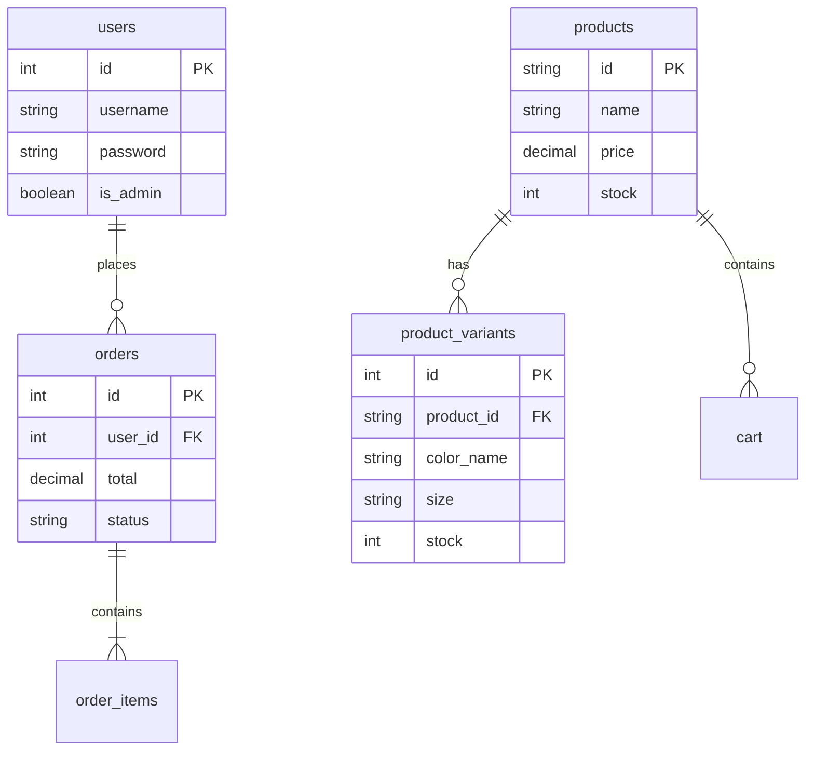

# projet-web-
# 🌌 OPAL — Premium Adventure Gear & Custom Footwear Store

<div align="center">


### Modern SPA E-Commerce Platform

Premium outdoor gear • Customizable footwear • Variant stock system • Admin dashboard

</div>

---

# ✨ Features

## 🛍️ Single Page Application (SPA)

- Vanilla JavaScript router
- Dynamic page rendering
- Optimistic UI updates
- Smooth transitions
- Global state management
- REST API integration

### Routes

```txt
#/
#/shop
#/product/:id
#/cart
#/login
#/register
#/profile
#/admin
```

---

## 👟 Advanced Shoe Customizer

- Dynamic color switching
- Variant-specific product images
- Size selection (US 7 → US 12)
- Real-time stock validation
- Interactive product rendering

### Example Variant

```json
{
  "color_name": "Lavender",
  "color_code": "#A78BFA",
  "size": "US 9",
  "stock": 4
}
```

---

## 📦 Variant Stock System

Stock is validated at multiple levels:

- Product page
- Shopping cart
- Checkout process
- Server-side validation

### Stock States

```txt
In Stock
Only 3 left
Sold Out
```

---

## 🛠️ Admin Dashboard

### Features

- Product CRUD
- Variant management
- Order management
- Image uploads
- Customer order tracking
- Stock control system

### Upload Support

- JPEG
- PNG
- WebP
- GIF

---

## 🔐 Authentication System

- Session authentication
- Role-based access control
- Admin permissions
- Profile management
- Password updates
- Algerian phone validation

Example:

```txt
0559734667
```

---

# ⚙️ Tech Stack

| Frontend | Backend | Database |
|---|---|---|
| HTML5 | PHP 7.4+ | MySQL |
| CSS3 | REST API | PDO |
| Vanilla JS | Sessions | Relational DB |

---

# 🧩 Architecture

```txt
SPA Router
   ↓
State Engine
   ↓
View Renderer
   ↓
REST API
   ↓
PHP Backend
   ↓
MySQL Database
```

---

# 🗄️ Database Schema



---

# 📁 Project Structure

```bash
shop/
│
├── index.html
├── style.css
├── app.js
├── api.php
├── db.php
├── init_db.php
│
├── uploads/
├── shoe1/
├── shoe2/
│
└── README.md
```

---

# ⚡ Installation

## 1️⃣ Clone Repository

```bash
git clone https://github.com/yourusername/opal-store.git
```

---

## 2️⃣ Move Project Into XAMPP

```txt
C:\xampp\htdocs\shop\
```

---

## 3️⃣ Create Database

Open:

```txt
http://localhost/phpmyadmin
```

Create database:

```txt
opal_store
```

Collation:

```txt
utf8mb4_general_ci
```

---

## 4️⃣ Run Database Seeder

Open in browser:

```txt
http://localhost/shop/init_db.php
```

Expected result:

```txt
Database initialized successfully!
```

---

## 5️⃣ Start Application

```txt
http://localhost/shop/
```

---

# 🔑 Default Accounts

| Role | Username | Password |
|---|---|---|
| 👑 Admin | `admin` | `admin123` |
| 👤 User | `user1` | `user123` |

---

# 🧭 Main Pages

## 🏕️ Landing Page

- Hero sections
- Glassmorphism design
- Scroll animations
- Product highlights

---

## 🛍️ Shop

- Live search
- Category filters
- Price sorting
- Responsive grid layout

---

## 🛒 Shopping Cart

- Slide-out cart drawer
- Persistent session cart
- Quantity management
- Optimistic updates

---

## 👤 Profile

Users can update:

- Username
- Password
- Phone number
- Address

---

## 🛡️ Admin Panel

### Product Management

- Add products
- Edit products
- Delete products
- Manage variants

### Orders Panel

- Track customer orders
- View order details
- Update order status

---

# 📈 Highlights

| Feature | Status |
|---|---|
| SPA Routing | ✅ |
| Variant System | ✅ |
| Admin Dashboard | ✅ |
| Authentication | ✅ |
| File Uploads | ✅ |
| Responsive Design | ✅ |

---

# 🚀 Future Improvements

- Stripe payments
- Wishlist system
- Multi-language support
- PWA support
- Dark mode
- Shipment tracking

---

# ⭐ Support

If you like this project:

- ⭐ Star the repository
- 🍴 Fork the project
- 🛠️ Contribute improvements

---

<div align="center">

# ⚔️ OPAL

### Explore Beyond Limits.

</div>
*   **Tab 1: Product Management:** Add products easily. If the `Customizable Shoe` checkbox is checked, the variant builder is revealed, letting you define custom colors, images, and sizes.
*   **Tab 2: Orders Panel:** Track incoming transactions. Review customer contact info, billing totals, order dates, and exact variant descriptions. Fulfill order steps by transforming orders from `pending` to `done` with automated state updates.

---

*Enjoy exploring the outdoors with OPAL! If you have any database connection issues, check that the host, name, username, and password credentials in [db.php](file:///c:/xampp/htdocs/shop/db.php) match your MySQL configurations.*
